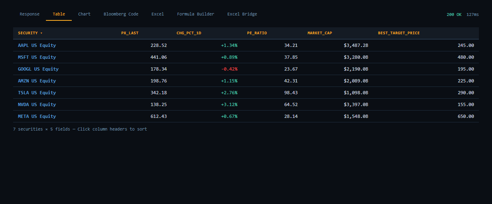
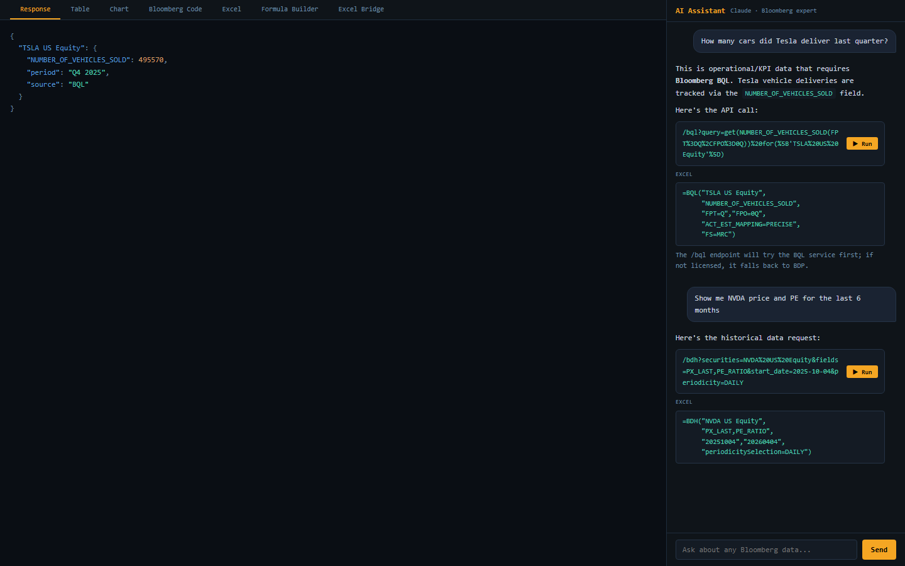
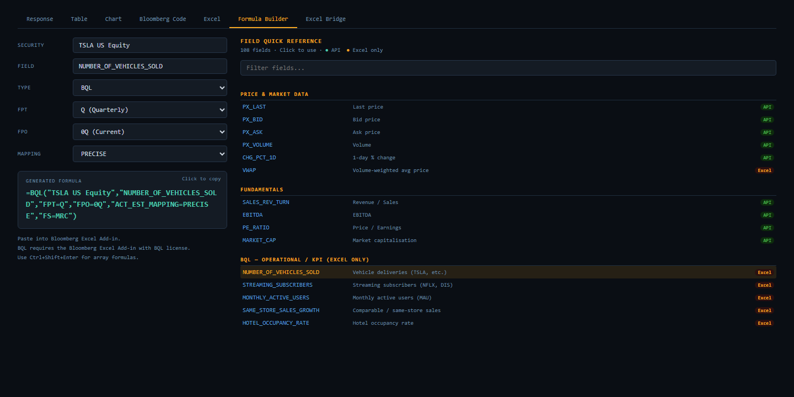
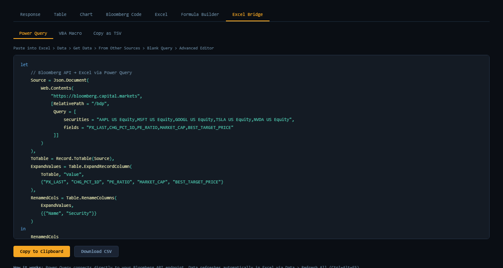
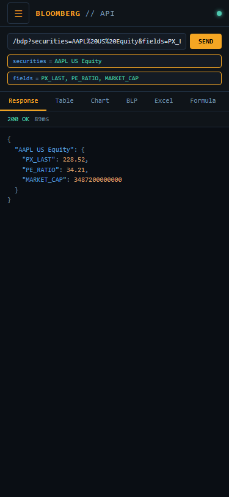

# Bloomberg Terminal API Playground

A self-hosted web playground for the Bloomberg Terminal, wrapping **blpapi** as a REST API and combining it with [OpenBB](https://openbb.co) for a unified market data interface.


## Screenshots

| Sortable Table View | AI Assistant (Claude) |
|---|---|
|  |  |

| Excel Formula Builder | Excel Bridge (Power Query) |
|---|---|
|  |  |

<p align="center">
  
  <br><em>Fully responsive on mobile</em>
</p>

## Features

- **REST API wrapper** for Bloomberg Terminal (`BDP`, `BDH`, `BDS`, `BQL`, intraday bars/ticks, field search, security lookup, yield curves)
- **Interactive playground UI** with categorized example requests, parameter editor, and one-click execution
- **AI assistant** (Claude-powered chatbot) that builds Bloomberg API calls and Excel formulas from natural language
- **Response views** -- JSON, sortable table, and auto-detected charts (time series, bar, pie)
- **Excel Formula Builder** -- generates `=BDP()`, `=BDH()`, `=BDS()`, `=BQL()` formulas with a 108-field quick reference
- **Excel Bridge** -- Power Query M code, VBA macro, TSV copy, and CSV download to get data into Excel
- **OpenBB integration** -- proxy routes to an OpenBB API for equities, fixed income, FX, economy, and derivatives data
- **Mobile responsive** -- sidebar drawer, scrollable tabs, and full-screen chat on small screens
- **Configurable endpoints** -- set Bloomberg API and OpenBB API URLs per-browser via the settings modal
- **CSV export** -- append `?format=csv` to any `/bdp`, `/bdh`, or `/bds` endpoint

## Prerequisites

- **Bloomberg Terminal** running on the same machine (or network-accessible via `BBG_HOST`)
- **Python 3.9+**
- **blpapi** Python package (requires the Bloomberg C++ SDK)

## Quick Start

```bash
# Clone the repo
git clone https://github.com/your-org/bloomberg-playground.git
cd bloomberg-playground

# Copy and edit environment config
cp .env.example .env
# Edit .env with your Bloomberg host/port, optional Anthropic key, etc.

# Install dependencies
pip install -r requirements.txt

# Start the all-in-one playground (API + static files + proxy)
python proxy-playground.py
```

Open **http://127.0.0.1:8081** in your browser.

## Architecture

```
Browser ──> proxy-playground.py (:8081)
               ├─ /bdp, /bdh, /bds, /bql, ...  ──> bbg_api.py (:8195) ──> Bloomberg Terminal
               ├─ /api/...                      ──> OpenBB API (:6900)
               └─ /*.html, /*.js, /*.css        ──> static files
```

### Running Components Separately

```bash
# Bloomberg API server only
uvicorn bbg_api:app --host 127.0.0.1 --port 8195

# OpenBB API (if installed)
openbb-api --host 127.0.0.1 --port 6900

# Proxy + static server
python proxy-playground.py
```

## Configuration

All configuration is via environment variables (or a `.env` file):

| Variable | Default | Description |
|----------|---------|-------------|
| `BBG_HOST` | `127.0.0.1` | Bloomberg Terminal host |
| `BBG_PORT` | `8194` | Bloomberg Terminal port |
| `API_HOST` | `127.0.0.1` | API server listen address |
| `API_PORT` | `8195` | API server listen port |
| `PROXY_HOST` | `127.0.0.1` | Proxy server listen address |
| `PROXY_PORT` | `8081` | Proxy server listen port |
| `OPENBB_HOST` | `127.0.0.1` | OpenBB API host |
| `OPENBB_PORT` | `6900` | OpenBB API port |
| `SERVE_DIR` | `./` | Static file directory |
| `ALLOWED_IPS` | `*` | Comma-separated IP whitelist, or `*` for all |
| `ANTHROPIC_API_KEY` | | Required for AI chatbot |
| `ANTHROPIC_MODEL` | `claude-sonnet-4-6` | Claude model for chatbot |

### Browser-Side Settings

Click the gear icon in the playground header to configure:
- **Bloomberg API URL** -- where BDP/BDH/BDS/BQL requests go
- **OpenBB API URL** -- where OpenBB requests go
- **Display name** -- shown in the status bar
- **Anthropic API key** -- saved to the server for chatbot use

Settings persist in `localStorage` per browser.

## File Structure

```
playground.html          Main playground UI (all-in-one SPA)
formula-builder.html     Standalone Excel formula builder
fields.js                Shared Bloomberg field definitions (108 fields, 9 categories)
bbg_api.py               FastAPI server wrapping blpapi
proxy-playground.py      Reverse proxy + static file server
proxy.py                 Minimal Bloomberg-only proxy
proxy-bbg.py             Bloomberg-only proxy variant
serve.py                 Simple static file server
requirements.txt         Python dependencies
.env.example             Environment variable template
.gitignore               Git ignore rules
```

## API Endpoints

### Bloomberg Terminal

| Method | Path | Description |
|--------|------|-------------|
| GET | `/bdp?securities=...&fields=...` | Reference data (current values) |
| GET | `/bdh?securities=...&fields=...&start_date=...` | Historical time series |
| GET | `/bds?security=...&field=...` | Bulk/array data |
| GET | `/bql?query=...` | Bloomberg Query Language |
| GET | `/intraday/bars?security=...&interval=...&start_datetime=...` | Intraday bars |
| GET | `/intraday/ticks?security=...&start_datetime=...` | Intraday ticks |
| GET | `/fields/search?query=...` | Field name search |
| GET | `/fields/info?fields=...` | Field metadata |
| GET | `/security/lookup?query=...` | Security search |
| GET | `/curve?curve_id=USD` | Yield curve |
| GET | `/health` | Health check |

Append `?format=csv` to `/bdp`, `/bdh`, or `/bds` for CSV download.

### OpenBB (proxied via `/api/`)

All OpenBB Platform API v1 endpoints are available under `/api/v1/...`.

## Security Notes

- **Never expose this directly to the internet** without IP whitelisting (`ALLOWED_IPS`) or a reverse proxy with authentication
- The API key is stored server-side in `config.json` (git-ignored)
- The proxy trusts `CF-Connecting-IP` header for Cloudflare deployments; strip this in other setups
- CORS is set to `*` for local development; restrict in production

## License

MIT License. See [LICENSE](LICENSE).
