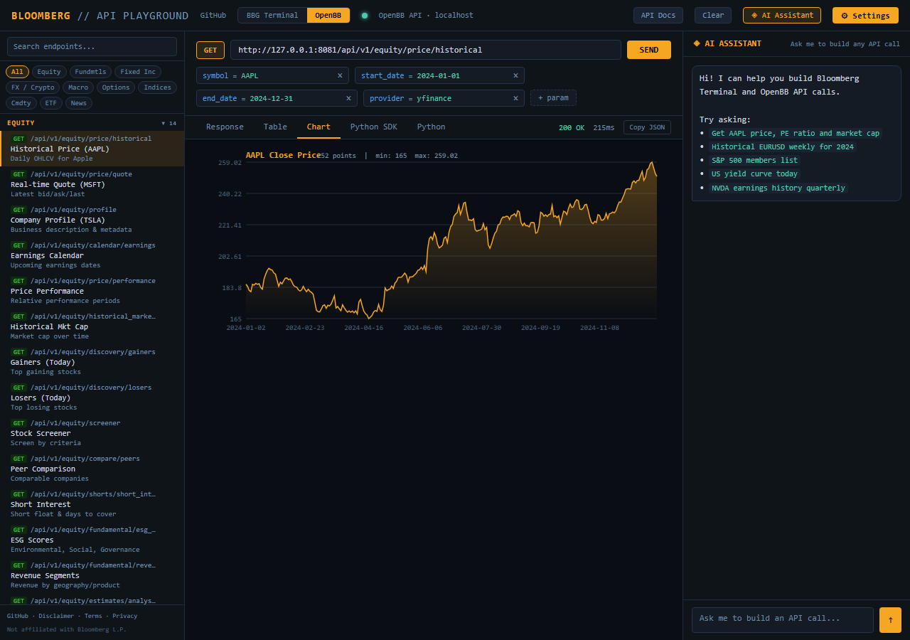
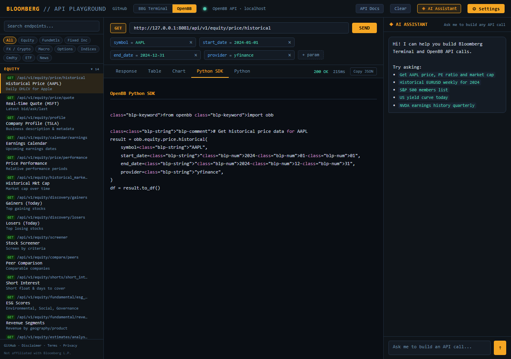
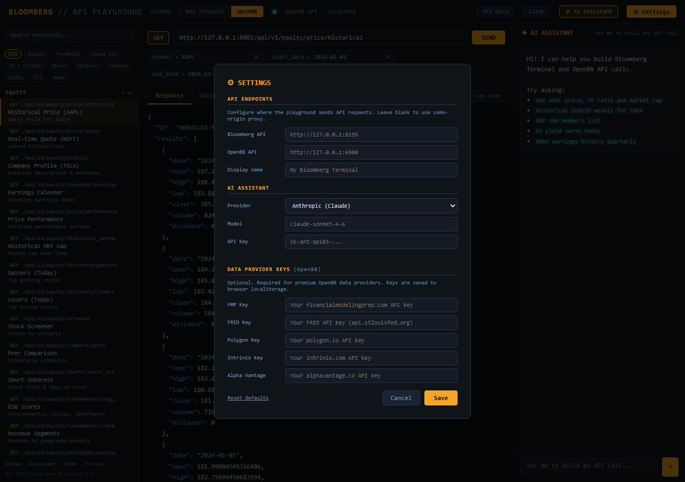

# BBG API Playground

A browser-based interface for querying financial data through [blpapi](https://www.bloomberg.com/professional/support/api-library/) and [OpenBB](https://openbb.co). Execute BDP, BDH, BDS, BQL, and intraday requests, visualize results as tables and charts, and let an AI assistant write the queries for you.

Supports [Claude](https://anthropic.com), [OpenAI](https://openai.com), and [Gemini](https://ai.google.dev) as AI providers. Bring your own key.


---

## Highlights

### Data Tables & Charts

Query results render as sortable tables with color-coded values, or as auto-detected charts (line, bar, pie). Copy as TSV, download as CSV, or visualize in one click.

<p>
  
  
</p>

### AI Assistant

Describe what you need in plain English. The assistant knows blpapi fields, BQL syntax, OpenBB endpoints, and generates runnable API calls you can execute directly.


### Python SDK & Excel Integration

OpenBB examples include ready-to-run Python snippets. The Formula Builder generates =BDP(), =BDH(), =BDS(), =BQL() formulas across 108 fields, and the Excel Bridge produces Power Query M code and VBA macros.

<p>
  
  
</p>

### Settings & Mobile

Configure AI providers, API endpoints, and data provider keys (FMP, FRED, Polygon, Intrinio, Alpha Vantage). Fully responsive on mobile with slide-out sidebar and full-screen chat.

<p>
  
  
</p>

---

## Features

- **REST API wrapper** for BDP, BDH, BDS, BQL, intraday bars/ticks, field search, security lookup, yield curves
- **Interactive playground** with categorized examples, parameter editor, and one-click execution
- **AI assistant** that generates API calls and Excel formulas from natural language (Claude, GPT, Gemini)
- **Multiple views**: JSON, sortable table, auto-detected charts
- **Formula Builder** with 108-field quick reference across 9 categories
- **Excel Bridge**: Power Query, VBA macro, TSV copy, CSV download
- **OpenBB integration** with 69 pre-built examples covering equities, fixed income, FX, macro, options, indices, commodities, ETFs, and news
- **Python SDK snippets** for every OpenBB example
- **Mobile responsive** with sidebar drawer, scrollable tabs, full-screen chat
- **Per-browser settings** for API URLs, AI provider, model selection, and data provider keys
- **CSV export** via `?format=csv` on any BDP/BDH/BDS endpoint

## Prerequisites

- **Terminal** running with blpapi access (local or network-accessible via `BBG_HOST`)
- **Python 3.9+**
- **blpapi** Python package (requires the C++ SDK)

## Quick Start

```bash
git clone https://github.com/heathermhuang/bbg-api-playground.git
cd bbg-api-playground

cp .env.example .env    # edit with your host/port and optional API keys

pip install -r requirements.txt
python proxy-playground.py
```

Open **http://127.0.0.1:8081**.

## Architecture

```
Browser ──> proxy-playground.py (:8081)
               ├─ /bdp, /bdh, /bds, /bql, ...  ──> bbg_api.py (:8195) ──> Terminal
               ├─ /api/...                      ──> OpenBB API (:6900)
               └─ static files
```

Components can also run independently:

```bash
uvicorn bbg_api:app --host 127.0.0.1 --port 8195   # API server only
openbb-api --host 127.0.0.1 --port 6900             # OpenBB (if installed)
python proxy-playground.py                           # proxy + static files
```

## Configuration

All settings are via environment variables or a `.env` file.

| Variable | Default | Description |
|----------|---------|-------------|
| `BBG_HOST` | `127.0.0.1` | Terminal host |
| `BBG_PORT` | `8194` | Terminal port |
| `API_HOST` | `127.0.0.1` | API server bind address |
| `API_PORT` | `8195` | API server port |
| `PROXY_HOST` | `127.0.0.1` | Proxy bind address |
| `PROXY_PORT` | `8081` | Proxy port |
| `OPENBB_HOST` | `127.0.0.1` | OpenBB API host |
| `OPENBB_PORT` | `6900` | OpenBB API port |
| `ALLOWED_IPS` | `*` | Comma-separated IP whitelist (`*` = all) |
| `TRUST_CF_IP` | | Trust `CF-Connecting-IP` header (Cloudflare only) |
| `BBG_RATE_LIMIT` | `30` | Requests/min per IP (terminal endpoints) |
| `CHAT_RATE_LIMIT` | `20` | Requests/min per IP (AI chat) |
| `ENABLE_DOCS` | | Expose `/docs` and `/openapi.json` |
| `AI_PROVIDER` | `anthropic` | Default provider: `anthropic`, `openai`, `google` |
| `AI_MODEL` | | Override default model |
| `ANTHROPIC_API_KEY` | | Claude API key |
| `OPENAI_API_KEY` | | OpenAI API key (or any compatible provider) |
| `GOOGLE_API_KEY` | | Gemini API key |

Set `OPENAI_BASE_URL` to use any OpenAI-compatible API (Groq, Together, Mistral, etc.).

### Browser-Side Settings

Click **Settings** in the header to configure API URLs, AI provider and model, display name, and data provider keys (FMP, FRED, Polygon, Intrinio, Alpha Vantage). Provider keys are stored in `localStorage` and never sent to the server.

## API Reference

### Terminal Endpoints

| Method | Path | Description |
|--------|------|-------------|
| GET | `/bdp?securities=...&fields=...` | Reference data (current values) |
| GET | `/bdh?securities=...&fields=...&start_date=...` | Historical time series |
| GET | `/bds?security=...&field=...` | Bulk/array data |
| GET | `/bql?query=...` | BQL queries |
| GET | `/intraday/bars?security=...&interval=...&start_datetime=...` | Intraday bars |
| GET | `/intraday/ticks?security=...&start_datetime=...` | Intraday ticks |
| GET | `/fields/search?query=...` | Field name search |
| GET | `/fields/info?fields=...` | Field metadata |
| GET | `/security/lookup?query=...` | Security search |
| GET | `/curve?curve_id=USD` | Yield curve |
| GET | `/health` | Health check |

Append `?format=csv` to `/bdp`, `/bdh`, or `/bds` for CSV output.

### OpenBB Endpoints

All OpenBB Platform API v1 routes are proxied under `/api/v1/...`.

## File Structure

```
playground.html        Single-page application (all UI)
formula-builder.html   Standalone Excel formula builder
fields.js              Shared field definitions (108 fields, 9 categories)
bbg_api.py             FastAPI server wrapping blpapi
proxy-playground.py    Reverse proxy + static file server
proxy.py               Minimal proxy variant
proxy-bbg.py           Terminal-only proxy variant
requirements.txt       Python dependencies
.env.example           Environment variable template
```

## Security

- **Do not expose directly to the internet** without IP whitelisting or a reverse proxy with authentication
- Per-IP rate limiting on all terminal and AI chat endpoints
- API keys stored server-side in `config.json` (0600 permissions, git-ignored)
- `CF-Connecting-IP` trust disabled by default
- `/docs` and `/openapi.json` disabled by default
- Error responses are sanitized (no stack traces or internal paths)
- CORS set to `*` for local development; restrict in production

## Disclaimer

This project is not affiliated with, endorsed by, or connected to Bloomberg L.P. Use of terminal data is subject to your existing license agreement. See [DISCLAIMER.md](DISCLAIMER.md) for full terms and privacy policy.

## License

MIT. See [LICENSE](LICENSE).
